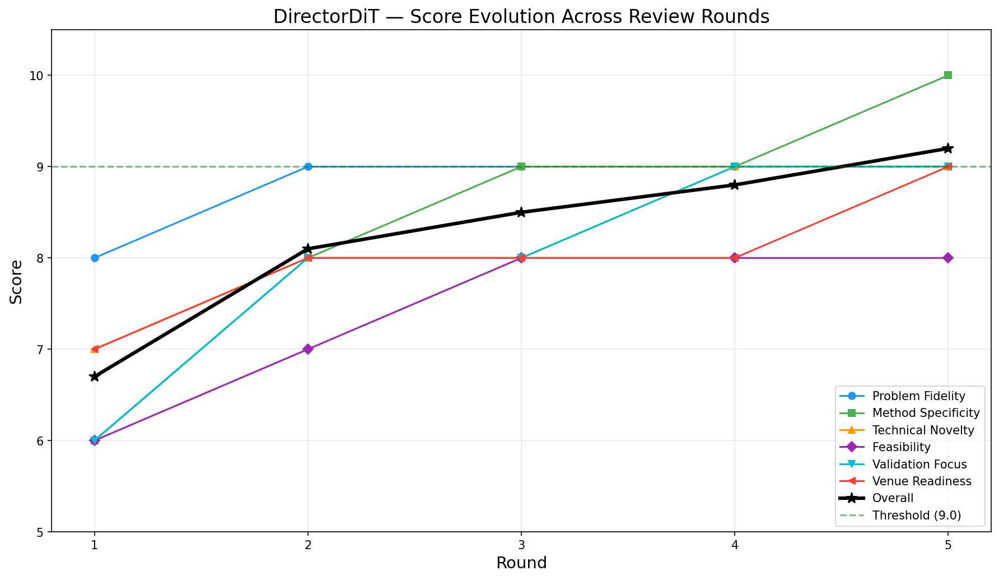

# Auto-Research-Refine

把“研究问题已经比较明确，但方法路线还比较模糊”的阶段，推进成一份可执行、可评审、可落地的研究方案；并在方案稳定后，继续落成一份真正能支撑论文叙事的详细实验计划。

这个仓库现在包含三个配套 skill：

- `research-refine`：把模糊想法打磨成“问题锚点明确、方法优先、简洁聚焦、兼顾前沿感”的技术方案
- `experiment-plan`：在方法稳定后，生成一份 claim-driven 的详细实验路线图，覆盖主结果、关键 ablation、复杂度对照、创新性验证、执行顺序和资源预算
- `research-refine-pipeline`：把前两者串起来，一次性完成“方法定型 + 实验规划”的一条龙流程



## 版本更新

### V2

- 引入 `Problem Anchor`，避免随着 review 轮数增加而偏离原始问题
- 强制每轮输出完整 proposal，不再只做局部修补
- 输出重心从“大而全实验”改成“方法优先 + claim-driven validation”
- reviewer 评分改成更关注问题一致性、方法具体性、技术创新性和验证聚焦

### V3

- 新增 `elegance-first` 约束，限制无谓复杂化、模块堆叠和平行贡献
- 新增 `Contribution Focus`、`Complexity Budget`、`Simplicity Check`，让主贡献更突出
- 强化 frontier-aware 方案选择，鼓励在合适时自然使用 LLM / VLM / Diffusion / RL 等现代技术
- 新增 `experiment-plan`，把 refine 后的方法继续落成详细实验计划
- 新增 `research-refine-pipeline`，把 `research-refine` 和 `experiment-plan` 串成一条 end-to-end pipeline

更完整的版本记录见 `V2_CHANGES.md` 和 `V3_CHANGES.md`。

## 适用场景

- 你已经有一个方向，但还没有清楚的方法设计
- 你知道要解决什么问题，但具体机制、训练目标、模块接口、loss 设计还不够清楚
- 你不希望方案随着 review 越变越复杂，而是希望它更聚焦、更优雅
- 你希望方法不仅可实现，也更贴近当前大模型时代的技术叙事
- 你希望在方法定型之后，马上继续得到一份可执行的实验计划
- 你希望这两个阶段能一次性串起来，不必手动分两步调用

## 项目结构

```text
research-refine-skill/
├── README.md
├── V2_CHANGES.md
├── V3_CHANGES.md
├── .gitignore
├── research-refine/
│   ├── SKILL.md
│   └── agents/
│       └── openai.yaml
├── experiment-plan/
│   ├── SKILL.md
│   └── agents/
│       └── openai.yaml
├── research-refine-pipeline/
│   ├── SKILL.md
│   └── agents/
│       └── openai.yaml
├── papers/
├── literature/
└── refine-logs/
```

## 安装

1. 把三个 skill 安装到 Claude Code：

```bash
cp -r research-refine experiment-plan research-refine-pipeline ~/.claude/skills/
```

2. 如果你要用外部 reviewer 回路，先配置 Codex MCP：

```bash
npm install -g @openai/codex
claude mcp add codex -s user -- codex mcp-server
```

3. 把你的本地论文放进 `papers/`，把阅读笔记或摘要放进 `literature/`。

## 使用方式

### 一条龙方式

如果你想一次性完成方法打磨和实验规划，直接调用：

```bash
/research-refine-pipeline "研究问题 | 初步方法 | 资源与约束"
```

示例：

```bash
/research-refine-pipeline "视频生成奖励建模 | 先用偏好数据训练多目标 reward model，但 loss 设计、数据组织、验证逻辑和实验执行顺序都还比较模糊 | 8xA100，目标 NeurIPS/ICLR"
```

### 分阶段方式

第一步，在这个项目目录里启动 Claude Code，然后调用：

```bash
/research-refine "研究问题 | 初步方法"
```

示例：

```bash
/research-refine "视频生成奖励建模 | 先用偏好数据训练多目标 reward model，但 loss 设计、数据组织和评测方案还比较模糊"
```

```bash
/research-refine "test-time scaling for agent planning | 我想结合 verifier 和 search，但还没想清楚具体 pipeline、对比基线和 ablation"
```

第二步，当 `research-refine` 产出稳定的 `FINAL_PROPOSAL.md` 后，再调用：

```bash
/experiment-plan "基于 refine-logs/FINAL_PROPOSAL.md 和 refine-logs/REVIEW_SUMMARY.md，生成详细实验计划"
```

也可以直接把最终方案粘进去：

```bash
/experiment-plan "方法已经确定，帮我把主实验、关键 ablation、复杂度对照、创新性验证和执行顺序规划出来：..."
```

## 输出内容

`research-refine` 会把中间结果和最终方案写到 `refine-logs/`。每一轮 refinement 都会保留完整 proposal，而不是只记录局部修改。典型文件包括：

- `round-0-initial-proposal.md`
- `round-1-review.md`
- `round-1-refinement.md`
- `REVIEW_SUMMARY.md`：汇总每一轮 reviewer 提了什么、这一轮解决了什么，以及方案是如何被简化/现代化的
- `FINAL_PROPOSAL.md`：干净的最终版方法文档
- `score-history.md`
- `REFINEMENT_REPORT.md`

`experiment-plan` 会继续在 `refine-logs/` 下产出：

- `EXPERIMENT_PLAN.md`：详细实验计划，按 claim 映射到实验块、主表、ablation、资源预算和执行顺序
- `EXPERIMENT_TRACKER.md`：运行追踪表，方便后续真正开跑实验

`research-refine-pipeline` 在串联两者时，还会额外整理：

- `PIPELINE_SUMMARY.md`：汇总最终方法 thesis、主贡献、必须验证的 claim、优先启动的实验和后续执行入口

## 建议输入模板

为了让 `research-refine` / `research-refine-pipeline` 输出更好，建议你的输入至少包含：

- 研究问题：你到底想解决什么
- 初步方法：你目前最模糊但最关键的方案设想
- 约束条件：算力、数据、时间、目标 venue

一个简单模板：

```text
问题：
目前想法：
已有资源：
约束：
希望达到的结果：
```

为了让 `experiment-plan` 更实用，建议补充：

- 最终方法或 `FINAL_PROPOSAL.md`
- 目标数据集 / benchmark
- 已有 baseline
- 资源预算
- 目标 venue 或论文风格

## 一句话定位

这是一个适合项目初期使用的 skill 组合：你既可以分阶段先打磨方法、再规划实验，也可以直接用一条龙 pipeline，把“方向感”变成“简洁而有创新性的具体方法 + 可执行的实验路线图”。

## 致谢

Special thanks to [wanshuiyin/Auto-claude-code-research-in-sleep](https://github.com/wanshuiyin/Auto-claude-code-research-in-sleep/tree/main) for the open-source inspiration; this project's research workflow and skill design were strongly informed by that work.
